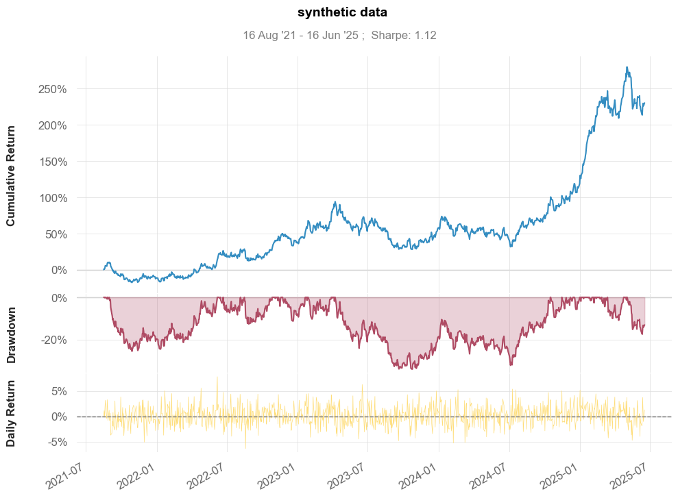
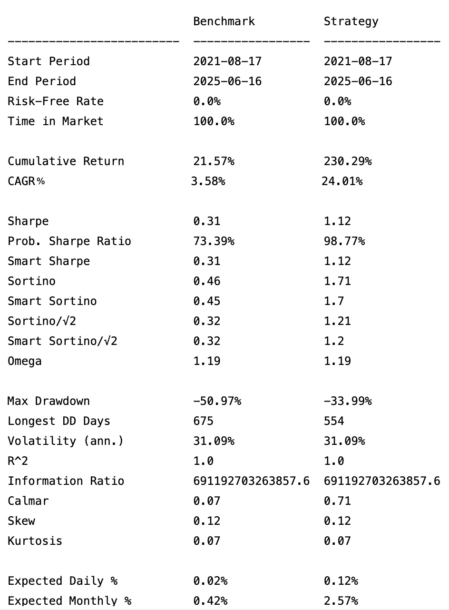
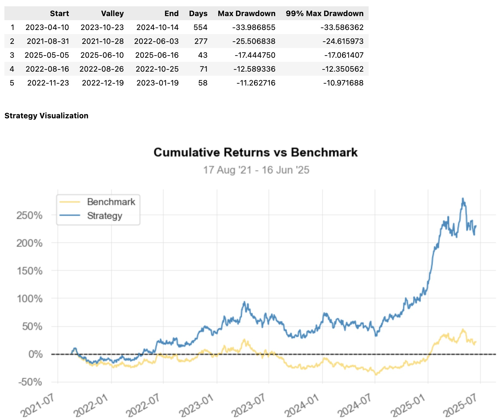

[](https://pypi.python.org/pypi/quantstats-reloaded)
[](https://pypi.python.org/pypi/quantstats-reloaded)
[](https://pypi.python.org/pypi/quantstats)
[](https://pypi.python.org/pypi/quantstats)
[](https://www.codefactor.io/repository/github/zillionare/quantstats-reloaded)
[](https://github.com/zillionare/quantstats-reloaded)


# QuantStats: Portfolio analytics for quants

**QuantStats** Python library that performs portfolio profiling, allowing quants and portfolio managers to understand their performance better by providing them with in-depth analytics and risk metrics.

This is a fork of [ranaroussi's quantstats project](https://github.com/ranaroussi/quantstats). Besides fixing bugs in the original project more promptly, we will proactively update the version to ensure compatibility with newer Python versions and commonly used Python libraries. We also achieve more rigorous dependency management via Poetry.

[Changelog »](./CHANGELOG.md)

## QuantStats is comprised of 3 main modules:

1. `quantstats.stats` - for calculating various performance metrics, like Sharpe ratio, Win rate, Volatility, etc.
2. `quantstats.plots` - for visualizing performance, drawdowns, rolling statistics, monthly returns, etc.
3. `quantstats.reports` - for generating metrics reports, batch plotting, and creating tear sheets that can be saved as an HTML file.

Here's an example of a simple tear sheet analyzing a strategy:

# Quick Start

```python
%matplotlib inline
import quantstats as qs
import numpy as np
import datetime as dt

# extend pandas functionality with metrics, etc.
qs.extend_pandas()

# Create random return data with a date index.
np.random.seed(42)
index = pd.date_range(end=dt.datetime.now(), periods=1000, freq='B')
stock = pd.Series(np.random.normal(0.001, 0.02, len(index)), index=index)

# show sharpe ratio
qs.stats.sharpe(stock)
```

Output:

```text
np.float64(1.1239729896454933)
```

## Visualize stock performance

```python
qs.plots.snapshot(stock, title='synthetic data', show=True)
```

Output:




## Creating a report

You can create 7 different report tearsheets:

1. `qs.reports.metrics(mode='basic|full", ...)` - shows basic/full metrics
2. `qs.reports.plots(mode='basic|full", ...)` - shows basic/full plots
3. `qs.reports.basic(...)` - shows basic metrics and plots
4. `qs.reports.full(...)` - shows full metrics and plots
5. `qs.reports.html(...)` - generates a complete report as html

Let' create an html tearsheet

```python
np.random.seed(42)
benchmark = pd.Series(np.random.normal(0.0, 0.02, len(index)), index=index)

qs.reports.full(stock, benchmark, output="/tmp/report.html")
```

Output will generate something like this:





## To view a complete list of available methods, run

```python
[f for f in dir(qs.stats) if f[0] != '_']
```

```text
['avg_loss',
 'avg_return',
 'avg_win',
 'best',
 'cagr',
 'calmar',
 'common_sense_ratio',
 'comp',
 'compare',
 'compsum',
 'conditional_value_at_risk',
 'consecutive_losses',
 'consecutive_wins',
 'cpc_index',
 'cvar',
 'drawdown_details',
 'expected_return',
 'expected_shortfall',
 'exposure',
 'gain_to_pain_ratio',
 'geometric_mean',
 'ghpr',
 'greeks',
 'implied_volatility',
 'information_ratio',
 'kelly_criterion',
 'kurtosis',
 'max_drawdown',
 'monthly_returns',
 'outlier_loss_ratio',
 'outlier_win_ratio',
 'outliers',
 'payoff_ratio',
 'profit_factor',
 'profit_ratio',
 'r2',
 'r_squared',
 'rar',
 'recovery_factor',
 'remove_outliers',
 'risk_of_ruin',
 'risk_return_ratio',
 'rolling_greeks',
 'ror',
 'sharpe',
 'skew',
 'sortino',
 'adjusted_sortino',
 'tail_ratio',
 'to_drawdown_series',
 'ulcer_index',
 'ulcer_performance_index',
 'upi',
 'utils',
 'value_at_risk',
 'var',
 'volatility',
 'win_loss_ratio',
 'win_rate',
 'worst']
```

```python
[f for f in dir(qs.plots) if f[0] != '_']
```

```text
['daily_returns',
 'distribution',
 'drawdown',
 'drawdowns_periods',
 'earnings',
 'histogram',
 'log_returns',
 'monthly_heatmap',
 'returns',
 'rolling_beta',
 'rolling_sharpe',
 'rolling_sortino',
 'rolling_volatility',
 'snapshot',
 'yearly_returns']
```

**\*\*\* Full documenttion coming soon \*\*\***

In the meantime, you can get insights as to optional parameters for each method, by using Python's `help` method:

```python
help(qs.stats.conditional_value_at_risk)
```

```text
Help on function conditional_value_at_risk in module quantstats.stats:

conditional_value_at_risk(returns, sigma=1, confidence=0.99)
    calculats the conditional daily value-at-risk (aka expected shortfall)
    quantifies the amount of tail risk an investment
```

## Installation

Install using `pip`:

```bash
$ pip install quantstats-reloaded --upgrade --no-cache-dir
```


## Known Issues

1. "For some reason, I couldn't find a way to tell seaborn not to return the monthly returns heatmap when instructed to save - so even if you save the plot (by passing `savefig={...}`) it will still show the plot." - this is a known issue of Ranaroussi's Quantstats library.
2. We dropped support for YFinance, since the author (live in Chinese mainland) has no env to test it. 

## Legal Stuff

**QuantStats** is distributed under the **Apache Software License**. See the [LICENSE.txt](./LICENSE.txt) file in the release for details.

## P.S.

Ranaroussi's Quantstats is a highly favored strategy metric evaluation library among quants, boasting over 5k stars on GitHub. However, it has been more than eight months since its last release, and several critical bugs remain unresolved, rendering some fundamental functions inoperable (e.g., Issue 416 makes most calculations impossible under Python 3.12).
Given that we've consistently recommended this library to students in our quantitative trading courses, we feel obliged to contribute to its maintenance and ensure timely releases of updated versions.