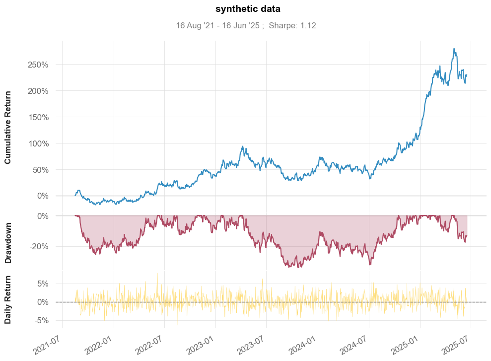
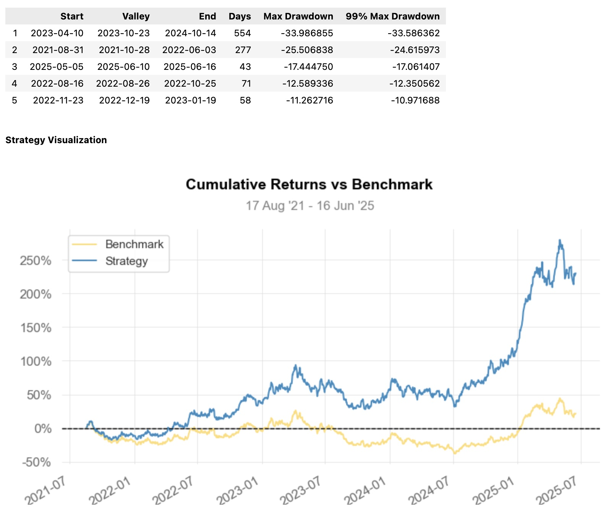

[](https://pypi.python.org/pypi/quantstats-reloaded)
[](https://pypi.python.org/pypi/quantstats-reloaded)
[](https://pypi.python.org/pypi/quantstats)
[](https://pypi.python.org/pypi/quantstats)
[](https://github.com/zillionare/quantstats-reloaded)

[English](README.md)  [中文](README_zh.md)

## QuantStats：量化投资组合分析工具
QuantStats 是一个 Python 库，用于执行投资组合分析，通过提供深入的分析和风险指标，帮助量化分析师和投资组合经理更好地理解其投资表现。

本项目是 ranaroussi 的 quantstats 项目 的分支。除了更及时地修复原项目中的 bug 外，我们还将主动更新版本，以确保与较新的 Python 版本和常用 Python 库的兼容性。我们还通过 Poetry 实现了更严格的依赖管理。

在移植过程中，我们将原始 0.0.64 版本的运行结果与使用类似 empyrical 方法的运行结果进行了对比，以确保移植的正确性。目前单元测试覆盖率达到了 71%，核心模块 stats.py 的单元测试覆盖率达到了 91%。

[变更日志 >>](CHANGELOG.md)
QuantStats 包含 3 个主要模块：
1. quantstats.stats - 用于计算各种性能指标，如夏普比率、胜率、波动率等。
2. quantstats.plots - 用于可视化性能、最大回撤、滚动统计数据、月度回报等。
3. quantstats.reports - 用于生成指标报告、批量绘图以及创建可保存为 HTML 文件的分析报表。

以下是一个分析策略的简单报表示例：

## 快速入门
```python
%matplotlib inline
import quantstats as qs
import numpy as np
import datetime as dt

# 使用指标扩展 pandas 功能
qs.extend_pandas()

# 创建带日期索引的随机回报数据
np.random.seed(42)
index = pd.date_range(end=dt.datetime.now(), periods=1000, freq='B')
stock = pd.Series(np.random.normal(0.001, 0.02, len(index)), index=index)

# 显示夏普比率
qs.stats.sharpe(stock)
```
输出：
```text
np.float64(1.1239729896454933)
```

## 可视化股票表现
```python
qs.plots.snapshot(stock, title='合成数据', show=True)
```

输出：



## 创建报告
您可以创建 7 种不同的分析报表：
* qs.reports.metrics(mode='basic|full", ...) - 显示基本 / 完整指标
* qs.reports.plots(mode='basic|full", ...) - 显示基本 / 完整图表
* qs.reports.basic(...) - 显示基本指标和图表
* qs.reports.full(...) - 显示完整指标和图表
* qs.reports.html(...) - 生成完整的 HTML 报告
  
让我们创建一个 HTML 分析报表：

```python
np.random.seed(42)
benchmark = pd.Series(np.random.normal(0.0, 0.02, len(index)), index=index)

qs.reports.full(stock, benchmark, output="/tmp/report.html")
```

输出将生成类似以下内容：





要查看可用方法的完整列表，请运行
```python
[f for f in dir(qs.stats) if f[0] != '_']
```

```text
['avg_loss',
 'avg_return',
 'avg_win',
 'best',
 'cagr',
 'calmar',
 'common_sense_ratio',
 'comp',
 'compare',
 'compsum',
 'conditional_value_at_risk',
 'consecutive_losses',
 'consecutive_wins',
 'cpc_index',
 'cvar',
 'drawdown_details',
 'expected_return',
 'expected_shortfall',
 'exposure',
 'gain_to_pain_ratio',
 'geometric_mean',
 'ghpr',
 'greeks',
 'implied_volatility',
 'information_ratio',
 'kelly_criterion',
 'kurtosis',
 'max_drawdown',
 'monthly_returns',
 'outlier_loss_ratio',
 'outlier_win_ratio',
 'outliers',
 'payoff_ratio',
 'profit_factor',
 'profit_ratio',
 'r2',
 'r_squared',
 'rar',
 'recovery_factor',
 'remove_outliers',
 'risk_of_ruin',
 'risk_return_ratio',
 'rolling_greeks',
 'ror',
 'sharpe',
 'skew',
 'sortino',
 'adjusted_sortino',
 'tail_ratio',
 'to_drawdown_series',
 'ulcer_index',
 'ulcer_performance_index',
 'upi',
 'utils',
 'value_at_risk',
 'var',
 'volatility',
 'win_loss_ratio',
 'win_rate',
 'worst']
```
```python
[f for f in dir(qs.plots) if f[0] != '_']
```

```text
['daily_returns',
 'distribution',
 'drawdown',
 'drawdowns_periods',
 'earnings',
 'histogram',
 'log_returns',
 'monthly_heatmap',
 'returns',
 'rolling_beta',
 'rolling_sharpe',
 'rolling_sortino',
 'rolling_volatility',
 'snapshot',
 'yearly_returns']
```


同时，您可以使用 Python 的 help 方法获取每个方法的可选参数信息：
```python
help(qs.stats.conditional_value_at_risk)
```
```text
Help on function conditional_value_at_risk in module quantstats.stats:

conditional_value_at_risk(returns, sigma=1, confidence=0.99)
    calculats the conditional daily value-at-risk (aka expected shortfall)
    quantifies the amount of tail risk an investment
```

## 安装
使用 pip 安装：
```bash
$ pip install quantstats-reloaded --upgrade --no-cache-dir
```

## 已知问题

> From Quantstats:
> 由于某些原因，我无法找到方法告诉 seaborn 在指示保存时不返回月度回报热图 - 因此即使您保存了绘图（通过传递 savefig={...}），它仍然会显示绘图。" 
> - 这是 Ranaroussi 的 Quantstats 库的已知问题。

## 法律声明
QuantStats 按照 Apache 软件许可证 分发。有关详细信息，请参阅发行版中的 LICENSE.txt 文件。

## 附言
Ranaroussi 的 Quantstats 是量化分析师中非常受欢迎的策略指标评估库，在 GitHub 上拥有超过 5k 星标。然而，自上次发布以来已经超过八个月，几个关键 bug 仍未解决，导致某些基本功能无法使用（例如 Issue 416 使得在 Python 3.12 下无法导入）。

鉴于我们在量化交易课程中一直向学生推荐这个库，我们觉得有责任为其维护做出贡献，并确保及时发布更新版本。
